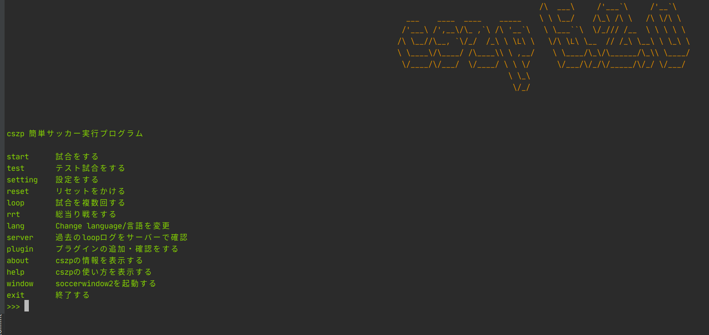

## インストール

### 前提条件
**soccerwindow2・rcssserverが実行できる状態にあること。また、bashが標準のコマンドシステムになっていること。OSはmac&linuxのみ。windows?そんなの知らん。**

もし、インストールができていない・実行できない等の場合には以下のプログラムを実行するとrcssserver 16.0.0とsoccerwindow2、librcsc、rcssmonitorがインストールされます。実行可能環境（確認済み）はlinux(Debian系)のみです。

また、ubuntu20.04LTSからは上記のコマンドを実行するためには、qt4のリポジトリを手動で入れなくてはいけません。（依存等の問題でおすすめできないので方法は載せません）

```shell
$ curl -s https://gist.githubusercontent.com/kumitatepazuru/6f731a999d92c62520aff9367882184e/raw/c51e4843b0978ccdfda8ead5619770fa32773fec/setup.sh | sh
```

### インストール方法
#### pythonをインストール
**開発にpythonを使っている方も飛ばさないで読んでください。**

以下のコマンドを実行してpython及びpipのインストールをします。
```shell
$ sudo apt install python3-pip
```

```eval_rst
.. important:: 以下のコマンドを実行し、versionが3.6.1未満だった場合はその下のコマンド入力して再インストールをする必要があります。
```
```shell
$ python3 --version
```

再インストールコマンド

```shell
$ sudo apt autoremove -y python3-pip
$ sudo apt install -y git make build-essential libssl-dev zlib1g-dev libbz2-dev libreadline-dev libsqlite3-dev wget curl llvm libncurses5-dev xz-utils tk-dev libxml2-dev libxmlsec1-dev libffi-dev liblzma-dev
$ git clone https://github.com/pyenv/pyenv.git ~/.pyenv
$ echo 'export PYENV_ROOT="$HOME/.pyenv"' >> ~/.bashrc
$ echo 'export PATH="$PYENV_ROOT/bin:$PATH"' >> ~/.bashrc
$ echo 'eval "$(pyenv init -)"' >> ~/.bashrc
$ source ~/.bashrc
$ pyenv install 3.6.4
$ pyenv global 3.6.4
```
#### cszpを実際にインストール
pip3というコマンドが使えるようになっているはずなので以下のコマンドを実行してcszpをインストールします。
```shell
$ pip3 install -U pip & pip3 install cszp
```

### インストール確認
cszpコマンドが使えるようになっているはずなので実行します。
```shell
$ cszp
```
そうして以下の画面が出たらインストールが成功しています。インストール時にエラー等が出た場合はやり方を確認して再度実行して見てください。それでも解決しない場合はgithubのissue等で教えてください。



```eval_rst
.. hint:: もし、下の画像に似たような警告が出てプログラムが止まる場合はEnterキーを押すと実行できます。原因としてはpluginsフォルダの中に余計なものまたは実行できないプラグインが存在する場合に表示されます。
.. image:: 20200621185709.png
```